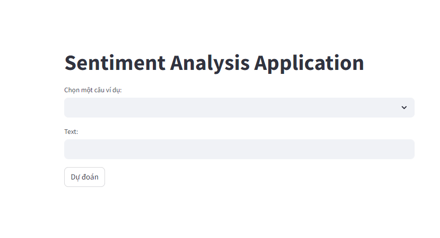
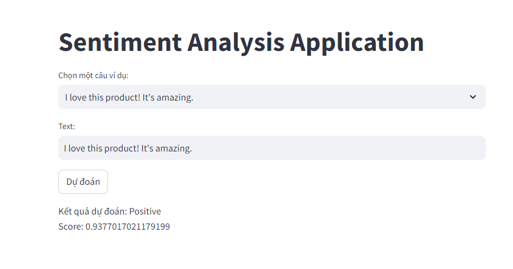

# Sentiment Analysis

## Table of Contents

+ [Introduction](#introduction)
+ [Interface Ressult](#interface)
+ [License](#license)

## Introduction 
- Sentiment analysis is a crucial task in natural language processing (NLP) that involves determining the sentiment expressed in a piece of text. It is widely used in various applications such as customer feedback analysis, social media monitoring, and market research. One effective approach to sentiment analysis is using Long Short-Term Memory (LSTM) networks, a type of recurrent neural network (RNN) that can capture long-range dependencies in sequential data.
- In this project, we will develop a sentiment analysis model using PyTorch, a popular deep learning framework. Our model will be based on an LSTM network, which is well-suited for handling sequential data like text. We will train the model on a labeled dataset of text reviews, where each review is associated with a sentiment label (positive or negative).
## Here are some application interface results 

## License 

This project is licensed under the Apache License - see the [LICENSE](LICENSE) file for details.
